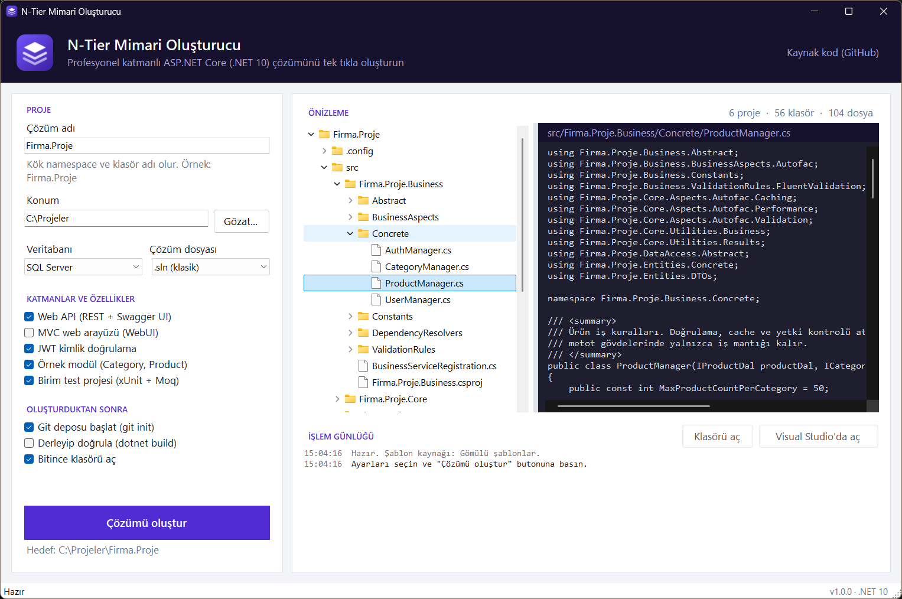

# N-Tier Mimari Oluşturucu

Yeni bir ASP.NET Core projesine başlarken katmanlı mimarinin projelerini, klasörlerini ve temel sınıflarını
her seferinde elle kurmak yerine tek tıkla oluşturan bir Windows uygulaması. Çözüm adını ve birkaç seçeneği
belirleyip butona basınca derlenmeye hazır bir .NET 10 çözümü çıkıyor: Core, Entities, DataAccess, Business ve
Web API katmanları, aralarındaki proje referansları, NuGet paketleri, isteğe bağlı JWT altyapısı, örnek bir
CRUD modülü ve birim testleri.

C# ve .NET 10 ile yazıldı, arayüz WinForms. Sağdaki önizlemede üretilecek her dosya, diske yazılmadan önce
içeriğiyle birlikte görülebiliyor.



## Ne üretiyor

Varsayılan seçeneklerle `Firma.Proje` adı için:

```
Firma.Proje/
├── src/
│   ├── Firma.Proje.Core/         projeden bağımsız altyapı
│   │   ├── Aspects/Autofac/      Validation, Caching, Performance, Transaction
│   │   ├── CrossCuttingConcerns/ cache, doğrulama, merkezi hata yönetimi
│   │   ├── DataAccess/           IEntityRepository, EfEntityRepositoryBase
│   │   ├── Entities/             IEntity, IDto, BaseEntity, User, OperationClaim
│   │   └── Utilities/            Results, BusinessRules, Interceptors, IoC, Security (JWT, hashing)
│   ├── Firma.Proje.Entities/     Concrete, DTOs
│   ├── Firma.Proje.DataAccess/   Abstract, Concrete/EntityFramework (DbContext, Dal'lar, Configurations)
│   ├── Firma.Proje.Business/     Abstract, Concrete, ValidationRules, BusinessAspects, Constants, DependencyResolvers
│   └── Firma.Proje.WebAPI/       Controllers, OpenAPI + Swagger UI, Program.cs
├── tests/
│   └── Firma.Proje.Tests/        xUnit + Moq
├── .config/dotnet-tools.json     dotnet-ef (yerel araç)
├── Directory.Build.props         ortak derleme ayarları
├── Directory.Packages.props      tüm NuGet sürümleri tek yerde
├── .editorconfig, .gitignore, .gitattributes, README.md
└── Firma.Proje.sln
```

Bağımlılıklar tek yöne akıyor: `WebAPI → Business → DataAccess → Entities → Core`.

Üretilen kodda neler var:

- Async generic repository (okumalar `AsNoTracking`), `IResult` / `IDataResult<T>` sonuç tipleri ve iş kurallarını
  sırayla çalıştırıp ilk hatada duran `BusinessRules.RunAsync`.
- Autofac ve Castle DynamicProxy ile aspect'ler: `[ValidationAspect]`, `[CacheAspect]`, `[CacheRemoveAspect]`,
  `[PerformanceAspect]`, `[TransactionScopeAspect]` ve JWT seçiliyse `[SecuredOperation]`. Bu yapının yaygın
  örneklerinde `invocation.Proceed()` sonrasında çalışan kod, async metotlarda görev bitmeden çalışıyor; burada
  cache, transaction ve süre ölçümü görev tamamlandıktan sonra yapılıyor. Transaction scope async metodun içinde
  açıldığı için ortam transaction'ı çağıran koda sızmıyor.
- Desenle cache silme, `MemoryCache`'in iç alanlarına reflection ile erişmek yerine anahtarlar ayrıca izlenerek
  yapılıyor; .NET sürümü değişince bozulmuyor.
- EF Core: DbContext DI ile geliyor, tablo ayarları `IEntityTypeConfiguration` sınıflarında, `CreatedDate` /
  `UpdatedDate` otomatik dolduruluyor. Development ortamında bekleyen migration'lar uygulama açılırken uygulanıyor.
- JWT: PBKDF2 (HMAC-SHA512, 210.000 tekrar) parola özeti, HS512 imza, her çözüme özel rastgele üretilen anahtar,
  kayıt/giriş uç noktaları ve Swagger UI'da "Authorize" butonu.
- Web API: REST controller'lar, `ProblemDetails` ile merkezi hata yönetimi (doğrulama 400, yetki 401/403),
  CORS, `/health` ve örnek istekleri içeren `.http` dosyası.
- Adı `Manager` ile biten sınıflar Business'ta, `Dal` ile bitenler DataAccess'te otomatik kaydediliyor.
- Central Package Management ve transitive pinning (dolaylı gelen `Microsoft.IdentityModel.*` paketleri aynı
  sürümde kalıyor), `Directory.Build.props`, `.editorconfig`.
- Çözümün kendi README'si: katmanlar, gerçek klasör ağacı, ilk migration komutları ve yeni bir özellik eklerken
  hangi katmana ne yazılacağı.

## Seçenekler

| Seçenek | Ne değişiyor |
|---|---|
| Çözüm adı | Kök namespace, klasör ve proje adları. Geçersiz adlar için öneri sunuyor ("Mağaza Yönetimi" → `MagazaYonetimi`). |
| Veritabanı | SQL Server (LocalDB), PostgreSQL ya da SQLite: NuGet paketi, `UseXxx` çağrısı ve bağlantı cümlesi. |
| Çözüm dosyası | Klasik `.sln` ya da yeni `.slnx`. |
| Web API / MVC arayüzü | Sunum katmanları; en az biri seçilmeli. |
| JWT kimlik doğrulama | User/OperationClaim, token üretimi, kayıt/giriş ve `[SecuredOperation]`. Web API gerektiriyor. |
| Örnek modül | Category ve Product üzerinden tüm katmanları gösteren CRUD. Kapalıyken boş klasörler `.gitkeep` ile geliyor. |
| Birim test projesi | xUnit + Moq ile iş kuralı ve yardımcı testleri. |
| Oluşturduktan sonra | `git init`, `dotnet build` ve klasörü Gezgin'de açma. Derleme çıktısı uygulamadaki günlükte akıyor. |

## Kurulum ve kullanım

Gereksinim: Windows 10/11 ve .NET 10 SDK (uygulama için gereken .NET Desktop Runtime SDK ile geliyor; üretilen
çözümü derlemek için SDK zaten gerekli).

[Releases](https://github.com/yigitkalaycioglu/ntier-generator/releases/latest) sayfasındaki zip'i açıp
`NTierGenerator.exe`'yi çalıştırmanız yeterli. Kaynaktan çalıştırmak için:

```powershell
dotnet run --project src/NTierGenerator.App
```

Tek dosyalık exe almak için `.\publish.ps1` (çıktı `publish\NTierGenerator.exe`). .NET kurulu olmayan bir
bilgisayar için `.\publish.ps1 -SelfContained`.

Son kullanılan seçenekler `%LOCALAPPDATA%\NTierGenerator\settings.json` dosyasında tutuluyor.

## Nasıl çalışıyor

- `src/NTierGenerator.Engine/Templates` klasörü üretilen çözümün birebir kopyası; dosyalar klasör yollarıyla
  birlikte DLL'e gömülü kaynak olarak ekleniyor.
- Dosya içeriklerinde ve yollarında `__Name__` gibi token'lar değiştiriliyor. Seçeneğe bağlı kısımlar dosya
  türüne göre yorum satırı olarak yazılan bloklarla işaretli: `//#if Auth` … `//#endif`,
  `<!--#if Sample-->`, `@*#if Sample*@`. `#elif`, `#else`, `!`, `&&`, `||` ve parantez destekleniyor;
  bilinmeyen bir sembol yazım hatası sayılıp hata veriyor. İçeriği tamamen koşullu olan dosyalar seçenek
  kapalıyken hiç üretilmiyor.
- `dot_gitignore` gibi adlar `.gitignore` olarak, `X.csproj.template` adları `X.csproj` olarak yazılıyor.
  `.template` son eki IDE'lerin şablon projelerini gerçek proje sanıp derlemesini engelliyor.
- Plan önce bellekte hazırlanıyor (önizleme bu planı gösteriyor), sonra diske yazılıyor. Çözüm dosyasındaki
  GUID'ler addan türetildiği için aynı seçenekler hep aynı çıktıyı veriyor. JWT anahtarı ve portlar rastgele.
- Şablonları yeniden derlemeden değiştirmek için `Templates` klasörünü exe'nin yanına kopyalamak yeterli;
  uygulama varsa oradan okuyor.

```
src/NTierGenerator.Engine          şablon işleme, çözüm üretimi, ad doğrulama (arayüzden bağımsız)
src/NTierGenerator.App             WinForms arayüzü
tests/NTierGenerator.Engine.Tests  xUnit testleri
```

## Testler

```powershell
dotnet test
```

Birim testleri tüm seçenek kombinasyonları için (3 veritabanı × 24 katman/özellik birleşimi × 2 çözüm biçimi)
planı üretip çıktıda değiştirilmemiş token ya da şablon yönergesi kalmadığını, JSON ve XML dosyalarının geçerli
olduğunu, projelerin ve çözüm dosyasının tutarlı olduğunu kontrol ediyor.

Üretilen çözümü gerçekten derleyen testler NuGet erişimi gerektirdiği ve birkaç dakika sürdüğü için ayrı:

```powershell
$env:NTIER_BUILD_TESTS = "1"; dotnet test
```

Bunlar beş farklı senaryoyu (her şey açık, minimal, yalnızca MVC + PostgreSQL, örneksiz JWT, JWT'siz örnek)
sıfırdan üretip derliyor, derleme uyarısını da hata sayıyor ve üretilen testleri çalıştırıyor. Ayrıca SQLite ile
üretilen API çalıştırılıp kayıt/giriş, 401/403, doğrulama hataları, iş kuralları ve cache temizleme uç noktalar
üzerinden denendi.

## Bilinen sınırlamalar

- Yalnızca Windows'ta çalışıyor (WinForms). Üretim motoru platformdan bağımsız ama ayrı bir komut satırı aracı yok.
- Hedef framework .NET 10. Paket sürümleri şablondaki `Directory.Packages.props` dosyasına sabit yazılı
  (Ekim 2026 itibarıyla güncel); güncellemek için o dosyayı değiştirmek gerekiyor.
- İlk migration üretilmiyor; çözümün README'sindeki `dotnet ef migrations add` komutuyla oluşturmak gerekiyor.
- MVC arayüzünde giriş/kayıt ekranı yok; JWT altyapısı yalnızca Web API için.
- Aspect'ler yalnızca DI'dan alınan servis arayüzü üzerinden yapılan çağrılarda çalışıyor; sınıf içinden ya da
  `new` ile oluşturulan nesnelerde devreye girmiyor.
- `[TransactionScopeAspect]` ortam transaction'ı destekleyen sağlayıcılara bağlı (SQL Server, PostgreSQL);
  SQLite ile denenmedi.
- Windows'un 260 karakter yol sınırı yüzünden çok derin klasörlerde oluşturulan çözümler derlenirken
  "dosya adı çok uzun" hatası alınabiliyor. Uygulama uzun yollarda uyarı veriyor.

## Lisans

MIT
